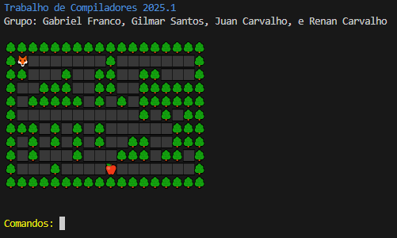
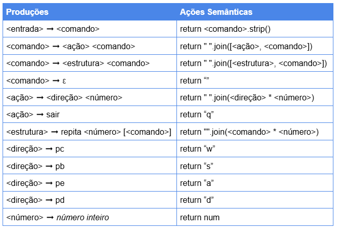
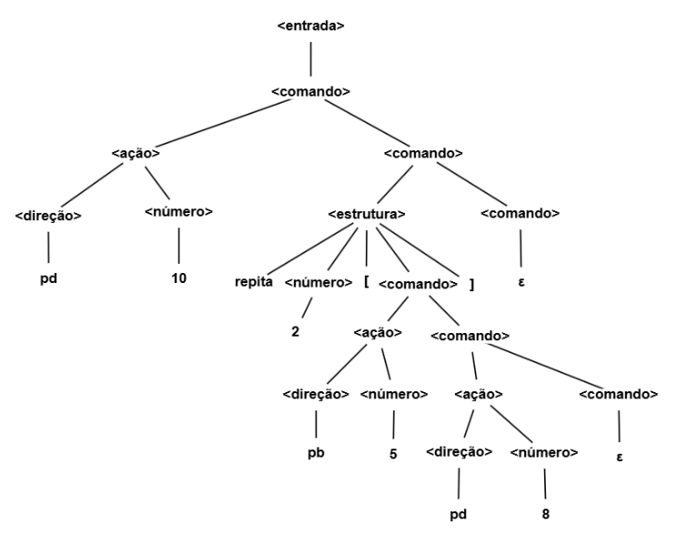

# GCC1730-compiladores

## Trabalho de Compiladores 2025.1

Grupo:

- Gabriel Franco
- Gilmar Santos
- Juan Carvalho
- Renan Carvalho

## Utilização

`pip install colorama sly` (caso não os possua instalados)

`python ./main.py`

O objetivo do jogo é, através da movimentação do jogador (raposa), atingir o objetivo final (maçã).

Opções de comandos: 
- `<direção> <número>`: direção e um número determinado de vezes que executará a ação
    - pc: para cima
    - pb: para baixo
    - pe: para esquerda
    - pd: para direita
    - Exemplo: `pd 5` (movimento para direita 5 vezes)

- `repita <número> [<comando>]`: repetição de um número determinado de vezes de um comando, podendo ser outro `repita <número> [<comando>]` ou `<direção> <número>`
    - Exemplo: `repita 2 [pb 2 pd 5]` (movimento `pb 2 pd 5` duas vezes)

- `sair`: encerra o jogo

O jogo somente permite o movimento do personagem com as teclas `w s d a` (ex.: "w s a a d d"), logo o analisar léxico/sintático além da verificação da corretude de tokens e sentenças, transforma a entrada do usuário para um texto executável pelo jogo.

Caso queira adicionar novos cenários, acesse o arquivo `labirintos.py`, adicione uma chave no mapa `labirintos` com o nome do cenário e adicione a matriz que corresponde ao cenário. Posteriormente, adicione na linha 9 do arquivo `main.py` o nome do cenário como argumento da instância do jogo para utiliza-lo.

Descrição dos caracteres do cenário na matriz:

- #: árvore (obstáculos)
- .: espaço disponivel para movimentação
- J: estado inicial do jogador
- F: estado final

## Tabela Sintática

## Exemplo de uma árvore de derivação

Sentença: `pd 10 repita 2 [pb 5  pd 8]`

## Exemplo de uma árvore de derivação anotada

Sentença: `pd 10 repita 2 [pb 5  pd 8]`

